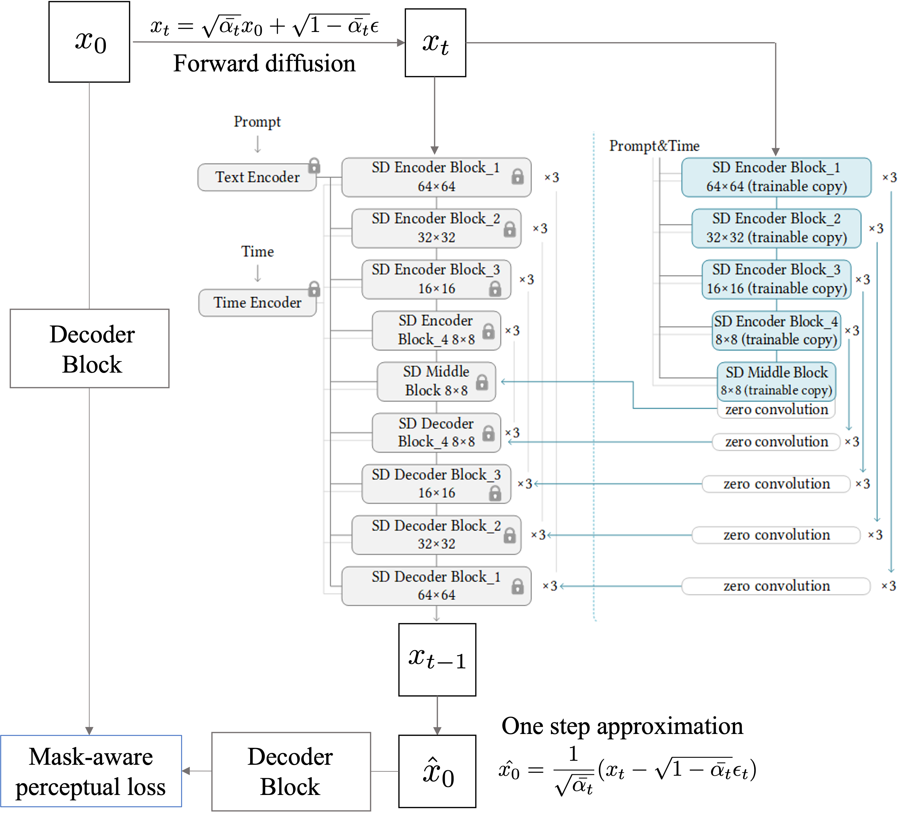
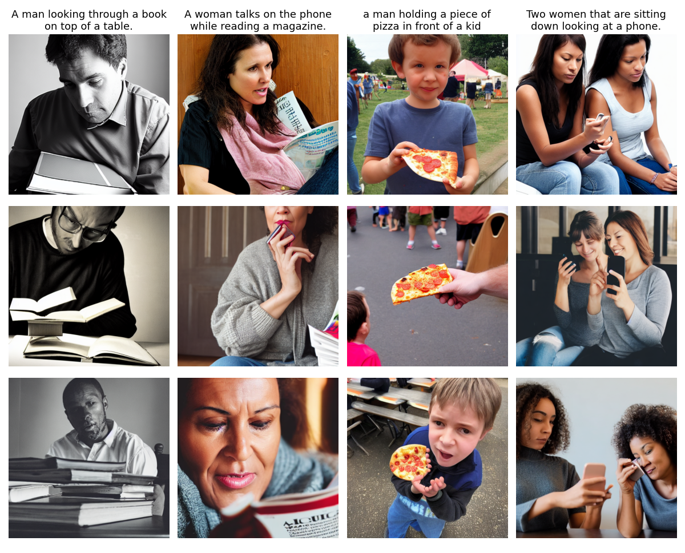

# Improving Latent Diffusion with Perceptual Mask-Aware Loss
Course Project for 16-824 Visual Learning and Recognition

Team Members:
- Abhinav Gupta (`ag6`)
- Poorvi Hebbar (`phebbar`)
- Vibhakar Mohta (`vmohta`)

Webpage: https://poorvirhebbar.github.io/Masked_LDM.html

## Abstract

Recent advances in AI-based image generation has made significant strides in text-image synthesis. In particular, diffusion models stand out by combining context using text prompts to generate very realistic and diverse images for text-to-image generation tasks. These networks have been adapted to various other tasks such as image inpainting, segmentation, style transfer, image to 3D, etc. However, diffusion models struggle to understand and model the spatial and kinematic constraints of the world and therefore perform poorly in depicting complex objects like human faces, body extremities, etc. In this work, we aim to address some of the limitations of diffusion models, in particular, stable diffusion, by optimizing diffusion latents using a mask-aware loss on human faces and body. We hypothesize that conditioning on this loss function will guide the model into focusing on "important" aspects of image generation, like human faces and poses. We believe our work can serve as a foundation for finetuning pre-trained diffusion models on more sophisticated loss functions. Our code is open source and is available at the project.

## Architecture and Approach
Architecture and Training Setup:  

Mask Aware Perceptual Loss:  

Our broad aim is to control image generation by guiding the diffusion process to minimize a perceptual mask-aware loss function such that it can generate kinematically feasible human poses and realistic facial expressions. We propose using the ControlNet architecture, and instead of using the parallel network to feed in conditioning, we plan to train it as a second modality that guides the diffusion model into minimizing perceptual loss.

- **Face Aware Loss:** A feature matching loss over the activations of a pre-trained face embedding network (VGGFace 2)
$$\mathcal{L}_{face} = \sum_k \sum_l \alpha^l_f || FE^l (\hat{c}^k_f) - FE^l (c^k_f) ||$$
    where $l$ denotes layers in the face embedding network $FE$, $\hat{c_f}^k$ and $c_f^k$ are the reconstructed and ground truth face crops of $k$ faces in the image, and $\alpha_f^l$ is a per layer normalization hyperparameter. This face loss helps the model learn low-level features and generate realistic human faces.

    
- **Masked LPIPS Loss:** To enforce visual and pose consistency on human images, we additionally use a Learned Perceptual Image Patch Similarity (LPIPS) loss on segmented human masks in the image. LPIPS metric essentially performs a weighted average over multiple feature maps obtained from the VGG network. In order to implement masked LPIPS loss, we first upsample feature maps of relevant layers to the original input image size and apply segmented human masks on them. Finally, we compute the LPIPS loss on the upsampled VGG feature maps. 
    $$\mathcal{L}_{lpips} = \sum_k \sum_l \alpha^l_p || VGG^l (\hat{c}^k_p) - VGG^l (c^k_p) || $$
    where $l$ denotes layers in the VGG, $\hat{c_p}^k$ and $c_p^k$ are the reconstructed and ground truth image mask crops of $k$ people in the image, and $\alpha_p^l$ is a per layer normalization hyperparameter.

A weighted average of the two loss functions is used to guide the diffusion process and minimize this loss function as represented by 
$$L_{total} = \lambda_1 L_{lpips} + \lambda_2 L_{face} + (1-\lambda_1 - \lambda_2) L_{LDM}$$

## Results
The first row shows the outputs of the Masked LDM model, the second row shows the outputs of our baseline, which is the ControlNet branched trained on the human dataset without changing the loss function. 

## Ablation Studies

We observed that when trained with $T=400$, the human faces and poses improved, but the generated outputs of the model had extremely smooth features. This can be attributed to the smoothening effect in the one-step predictions at high timesteps. Hence a timestep $T=100$ was chosen to maintain low-level features in generated output images. As the face pixels cover a small portion of the image, higher values of $\lambda_2$ resulted in better face outputs. Tuning $\lambda_1$ is again crucial for our setup, as it controls how much the model emphasizes the masked humans. It was observed that $\lambda_1$ and $\lambda_2$ greatly determine output quality, while $T$ controls the smoothness in the output image. Fig \ref{fig:ablation} shows the sampled model outputs after 12 epochs of training on custom prompts using the same random noise vector. It can be seen by human evaluation that the first row with ${\lambda_1 = 0.2, \lambda_2 = 0.5,T=100}$ gave the best results, while the second row with ${\lambda_1 = 0.2, \lambda_2 = 0.5, T=400}$ gave the second best results.

## Scripts
- `train_mldm.py`: The main script used to train the mldm model. It loads a pretrained ControlNet model with weights initialized from the Stable Diffusion 1.5 checkpoint. Dataloaders must be customized for the dataset being used. The masked perceptual loss is used, and the values of $\lambda_1$ and $\lambda_2$ and $T$ can be changed in the scrpit.

- `train_mldm_baseline.py`: The main script used to train the baseline model. It loads a pretrained ControlNet model with weights initialized from the Stable Diffusion 1.5 checkpoint. Dataloaders must be customized for the dataset being used. The loss function used here is the default DDPM loss

- `resume_mldm.py`: Script to resume training from a checkpoint. The version number for the checkpoint needs to be set on top of the script, and the script looks for the checkpoint in `lightning_logs/version_<num>/checkpoints`

- `fid_mldm.py`: Script to get the FID metric for a checkpoint. The version number needs to be specified at the top of the script. If its set to None, then the script will use a default Stable Diffusion model to calculate the FID.

## Acknowledgements
We would like to thank Nupur Kumari for guiding us throghout our work. We would also like to thank Prof. Deepak Pathak and the Teaching Assistants of the Visual Learning and Recognition course for their constant support and guidance.
